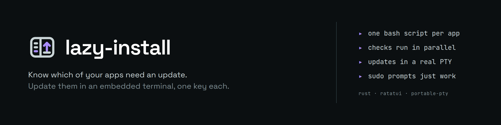
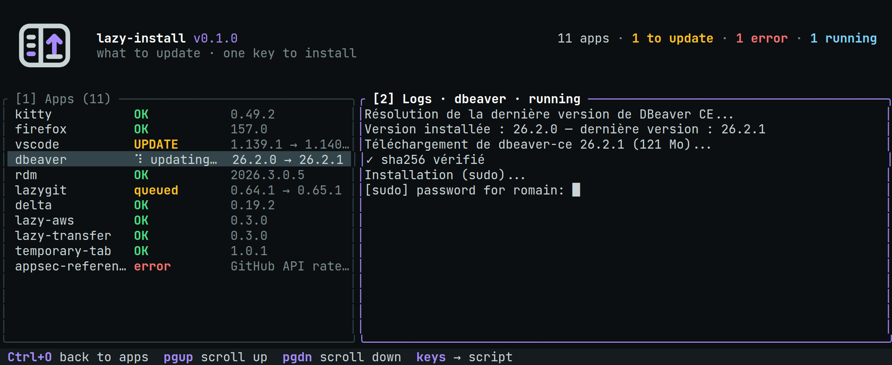

<p align="center">
  <picture>
    <source media="(prefers-color-scheme: dark)" srcset="docs/assets/banner-dark.png">
    <source media="(prefers-color-scheme: light)" srcset="docs/assets/banner-light.png">
    
  </picture>
</p>

<p align="center">
  <a href="https://github.com/RomainMILLAN/lazy-install/actions/workflows/ci.yml"></a>
  <a href="https://github.com/RomainMILLAN/lazy-install/releases"></a>
  <a href="https://www.rust-lang.org"></a>
  <a href="LICENSE"></a>
</p>

<p align="center">
  <picture>
    <source media="(prefers-color-scheme: dark)" srcset="docs/assets/screenshot-update-dark.png">
    <source media="(prefers-color-scheme: light)" srcset="docs/assets/screenshot-update-light.png">
    
  </picture>
</p>

An application is a **name** and a **bash script**. The script answers two
questions: *is there an update?* (`needs_update`) and *install it* (`update`).
lazy-install runs every `needs_update` at start-up, shows a tag per application,
and runs `update` in a real pseudo-terminal: `sudo` prompts, `[y/N]` questions
and progress bars work inside the TUI.

## Features

- One tag per application: `OK`, `UPDATE`, `checking…`, `error`, `invalid`,
  `queued`, `updating…`, `failed`, with `installed → latest` versions.
- Checks run in parallel at start-up (4 at a time, 30 s timeout each).
- `u` updates one application, `U` updates every outdated one, one after the
  other. A failure does not stop the queue.
- The update runs in an embedded terminal; the last run of each application stays
  on screen, and a plain-text copy goes to
  `~/.local/state/lazy-install/logs/<app>.log`.
- Add, edit and delete applications from the TUI. A missing script can be created
  from the template.

## Installation

From a GitHub release (Linux x86_64 / aarch64):

```sh
curl -fsSL https://github.com/RomainMILLAN/lazy-install/releases/latest/download/lazy-install-linux-x86_64.tar.gz \
  | tar -xz -C ~/.local/bin lazy-install
```

Each release publishes a `SHA256SUMS`; check it before installing.

From source:

```sh
cargo install --locked --path .
```

## Usage

```sh
lazy-install                 # ~/.config/lazy-install/config.json
lazy-install --config PATH   # another config file
lazy-install --light         # light theme
lazy-install --template      # print the script template
```

## Headless check

`lazy-install --check` runs every `needs_update` without the TUI, prints what
needs attention, and exits:

| Code | Meaning |
|---|---|
| 0 | at least one update |
| 1 | no update found (some apps may be in error) |
| 2 | nothing could be checked (unreadable config, no app, usage error) |

```sh
if lazy-install --check; then echo "updates available"; fi
```

```text
UPDATE     vscode             1.139.1 → 1.140.0
ERROR      appsec-references  GitHub API rate-limited
INVALID    old-tool           /x.sh is writable by others — run: chmod o-w /x.sh
NO-ANSWER  rdm
1 update, 1 error, 1 invalid, 1 no answer, 10 up to date
```

`--check --json` prints the same report as a stable object, in config order:

```json
{
  "updates": [{ "name": "vscode", "installed": "1.139.1", "latest": "1.140.0" }],
  "errors": [{ "name": "appsec-references", "kind": "error", "message": "GitHub API rate-limited" }],
  "up_to_date": 10
}
```

- `kind` is `error` (the check failed), `invalid` (the script is refused) or
  `no-answer` (no result before the deadline).
- Missing values are `null`.

`--check` never writes anything: no config save, no run log, no `debug.log`. It
runs fine while the TUI is open.

## Configuration

`~/.config/lazy-install/config.json`:

```json
{
  "scripts_dir": "~/.config/lazy-install/scripts",
  "max_parallel_checks": 4,
  "apps": [
    { "name": "kitty", "script": "kitty.sh" },
    { "name": "dbeaver", "script": "~/dotfiles/dbeaver/lazy-install.sh" }
  ]
}
```

- `scripts_dir` (default `~/.config/lazy-install/scripts`): where relative
  `script` paths are resolved, and where the file picker opens.
- `max_parallel_checks` (default 4, 1 to 16).
- `script`: relative to `scripts_dir`, `~/…`, or absolute.

The file is strict. A JSON error or an unknown field stops lazy-install with
`file:line:column` and the file is never rewritten. A missing file is an empty
configuration. Saves are atomic, and a file changed by someone else while the TUI
runs is never overwritten.

## The script contract (v1)

```bash
#!/usr/bin/env bash
# lazy-install: v1

needs_update() {
  local installed latest
  installed="$(mytool --version | awk '{print $2}')"
  latest="$(curl -fsSI https://github.com/OWNER/REPO/releases/latest \
    | sed -n 's#^location:.*/tag/v\([^[:space:]]*\).*#\1#ip' | tr -d '\r')"
  [[ -n $latest ]] || return 2
  if [[ $installed == "$latest" ]]; then
    li_up_to_date "$installed" "$latest"
  else
    li_update_available "$installed" "$latest"
  fi
}

update() {
  ~/dotfiles/mytool/update.sh -f
}
```

- The marker line `# lazy-install: v1` is required.
- The script is **sourced** at run time. It must only define functions, with no
  top-level side effects.
- `needs_update` **must end with a helper**:

  | Helper | Exit code | Tag |
  |---|---|---|
  | `li_update_available [installed] [latest]` | 0 | `UPDATE` |
  | `li_up_to_date [installed] [latest]` | 10 | `OK` |

  The helper writes a token signed with a per-run nonce. "Up to date" requires
  the code **and** the token, so a crash, a timeout, or a plain `return 10` is
  shown as `error` and never as `OK`.
- `needs_update` runs without a terminal (stdin is `/dev/null`) and is killed
  after 30 s.
- `update` runs in a pseudo-terminal. Exit 0 means success.
- `LAZY_INSTALL=1` and `LAZY_INSTALL_MODE=check|update` are exported.
- Function names that shadow a bash builtin or keyword (`printf`, `command`, …),
  and names starting with `li_`, are refused.

**Validation** happens when an application is added or edited. It is static and
runs no code from the script:

- file permissions;
- `bash -n`;
- the marker line;
- `needs_update()` and `update()` written out in the text.

The textual checks run again before every execution.

## Trust model

A script runs with your rights; lazy-install is not a sandbox. What it prevents is
**someone else** putting code in it:

- The script, and every directory above it up to `/`, must belong to you (or to
  root for directories), and must not be writable by others. `/tmp` is refused on
  purpose, sticky bit or not.
- Group write is accepted only for your **private group**: your primary group,
  named after your login, with no other member. With a `002` umask, `~/dotfiles`
  is `775`, and that is fine.
  - This is detected from `/etc/group` and `/etc/passwd` only. On a machine using
    NSS (sssd, LDAP), use `chmod g-w`.
- `config.json` and the logs directory follow the same rule.
- The check runs again before every execution. It covers the contract script,
  **not** what that script calls.
- The environment is cleaned before running bash: `BASH_ENV`, `ENV`,
  `BASH_FUNC_*`, `SHELLOPTS`, `BASHOPTS`, `PS4`, `CDPATH` and `GLOBIGNORE` are
  removed.

Two consequences to keep in mind:

- If your scripts live in a dotfiles repository, a `git pull` can add an
  application that will run at the next start.
- Never put a token in a script. Read it from the environment or from `pass`:
  the scripts directory is versioned.

## Keybindings

| Key | Action |
|---|---|
| `↑↓` / `jk` | navigate |
| `u` | update the selected application |
| `U` | update every outdated application |
| `a` / `e` / `d` | add / edit / delete |
| `r` / `R` | check the selected / every application |
| `/` | filter inline: type to filter live, `↑↓` move, `enter` keep, `esc` clear |
| `1` / `2` (or `tab`) | focus the Apps / Logs panel (during a run, `1` goes to the script) |
| `Ctrl+O` | back to Apps while a run has the keys |
| `PgUp` / `PgDn` | scroll the terminal |
| `?` | help |
| `Ctrl+L` | toggle theme |
| `q` | quit (asks before killing a running update) |

**Focus.** When an update starts, its terminal takes every key (including
`Ctrl+C`, which goes to the script). When the update ends, focus returns to the
list, and keys are ignored for 300 ms so that a password still being typed does
not land in the list.

**Password banner.** While an update runs and the list has the keys, a banner
says so. It turns red when the run looks like it is waiting for a password.

In the script field, `tab` opens a file picker.

## Development

```sh
cargo test --locked
cargo clippy --locked --all-targets -- -D warnings
cargo fmt -- --check
```

## License

MIT
